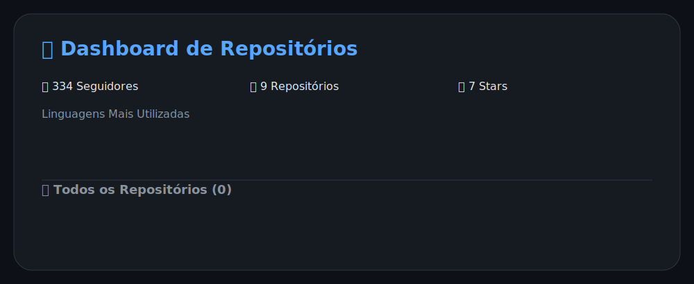

# 🚀 GitHub Profile Auto Updater

Transforme seu perfil do GitHub em um painel dinâmico e profissional — atualizado automaticamente, sem esforço.

Este projeto em **Node.js** utiliza **GitHub Actions** para manter seu `README.md` sempre atualizado com estatísticas, badges e dashboards modernos.

---

## ✨ Destaques

- 🔥 Atualização automática do README
- 📊 Estatísticas do perfil em tempo real
- 🎯 Organização inteligente por linguagem
- ⏱️ Execução automática a cada 10 minutos
- 🔁 Sistema de retry para maior confiabilidade
- 🧼 Commits inteligentes (sem alterações desnecessárias)
- 🎨 Dashboards e badges dinâmicos em SVG

---

## 🧠 Como Funciona

1. O workflow do **GitHub Actions** é acionado automaticamente
2. Os scripts consultam a **GitHub REST API**
3. Os dados são processados e organizados
4. O `README.md` é gerado com base no template
5. Se não houver mudanças, nenhum commit é realizado

✔️ Simples, eficiente e totalmente automatizado

---

## 🛠️ Stack Utilizada

* Node.js
* GitHub Actions
* GitHub REST API
* JSON
* Markdown
* SVG

---

## 📁 Estrutura do Projeto

### 🧠 Templates

Arquivo base para geração do README final

* `templates/README.template.md`

### ⚙️ Scripts

Automação e geração de dados

* `scripts/update-readme.js` → Atualiza o README
* `scripts/generate-dashboard.js` → Cria dashboards SVG
* `scripts/generate-cron.js` → Controla agendamentos
* `scripts/bot-local.js` → Execução local
* `iniciar-bot.bat` → Inicialização no Windows

### 🔧 Configurações

* `.github/settings.json` → Define usuário, horários e intervalo

### 🤖 Automação

* `.github/workflows/update-readme.yml` → Workflow principal

### 📄 Arquivos principais

* `README.md` (gerado automaticamente)
* `package.json`
* `.gitignore`

---

## 📊 Dashboard

<p align="center">
  
</p>

---

<!--START_SECTION:dynamic-->

⭐ **Total de Estrelas:** 9

👥 **Seguidores:** 417

🕒 **Última atualização:**  
26/06/2026 20:37:36

⏭ **Próxima atualização:**  
26/06/2026 20:47:36

<!--END_SECTION:dynamic-->

---

## ▶️ Executar Manualmente

### 🌐 Pelo GitHub

1. Acesse a aba **Actions**
2. Selecione **Update README**
3. Clique em **Run workflow**

### 💻 Localmente

```bash
npm run setup
```

<br>

> ⚠️ **Observação importante:**
> Para execução local contínua, mantenha o **VS Code aberto** com o projeto rodando e o comando `npm run setup` ativo.
> Além disso, deixe o **PC ou notebook ligado**, caso contrário o bot será interrompido.

---

## 💡 Onde Usar

- ✔️ README de perfil
- ✔️ Portfólios modernos
- ✔️ Projetos de automação
- ✔️ Demonstrações com GitHub Actions

---

## 👩‍💻 Autora

<p align="center">

<a href="https://www.linkedin.com/in/rafaelasommergon%C3%A7alves16/">

</a>

<a href="https://github.com/RafaelaSommer">

</a>

<a href="https://wa.me/5519971015465">

</a>

</p>

---

## ⚡ Sobre

Desenvolvedora focada em **automação**, **dados** e **boas práticas**, criando soluções inteligentes com:

- 🐍 Python
- ⚙️ GitHub Actions
- 🔗 APIs
